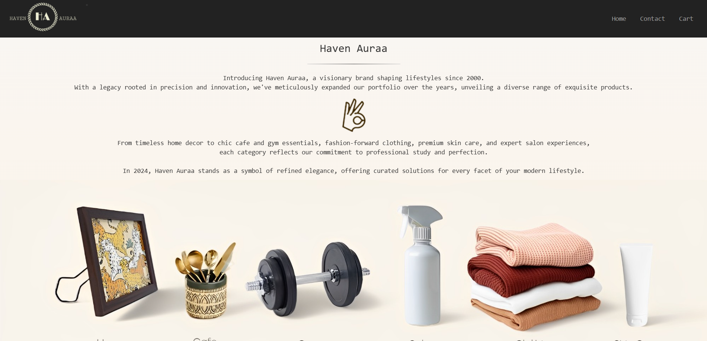
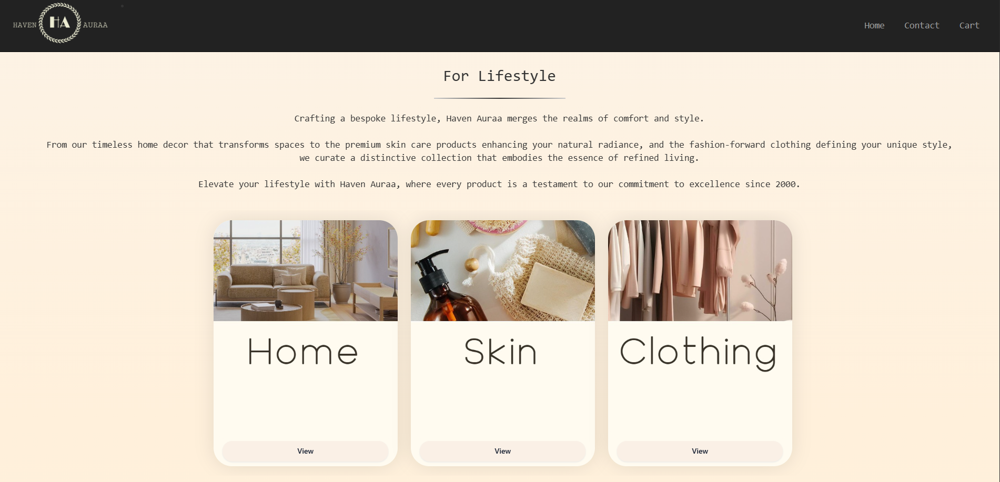
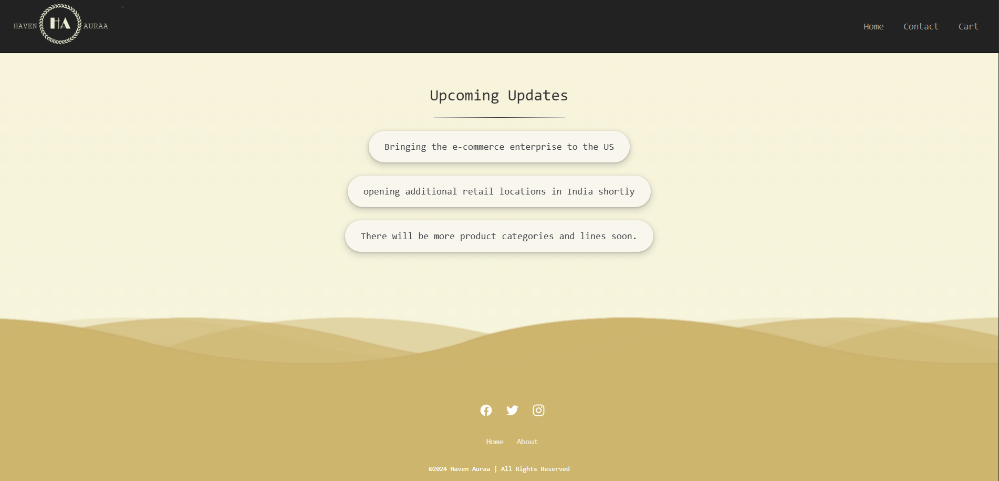

# Havenauraa – Luxury Product Showcase Website

Havenauraa is a front-end web project built using HTML, CSS, and JavaScript.  
It is designed to elegantly present different product lines offered by the brand, with an emphasis on a luxurious and immersive browsing experience.

---

## Features
- Elegant and modern interface for a premium brand feel.
- Showcases multiple product lines with dedicated sections.
- Smooth scrolling and transitions for a refined browsing experience.
- Responsive design ensuring compatibility across devices.
- Interactive elements for improved user engagement.

---

## Technologies Used
- **HTML5** – Content structure.
- **CSS3** – Styling, layout, animations, and responsiveness.
- **JavaScript (ES6)** – Interactivity and dynamic UI effects.

---

## Screenshots
  

---

## Project Structure
